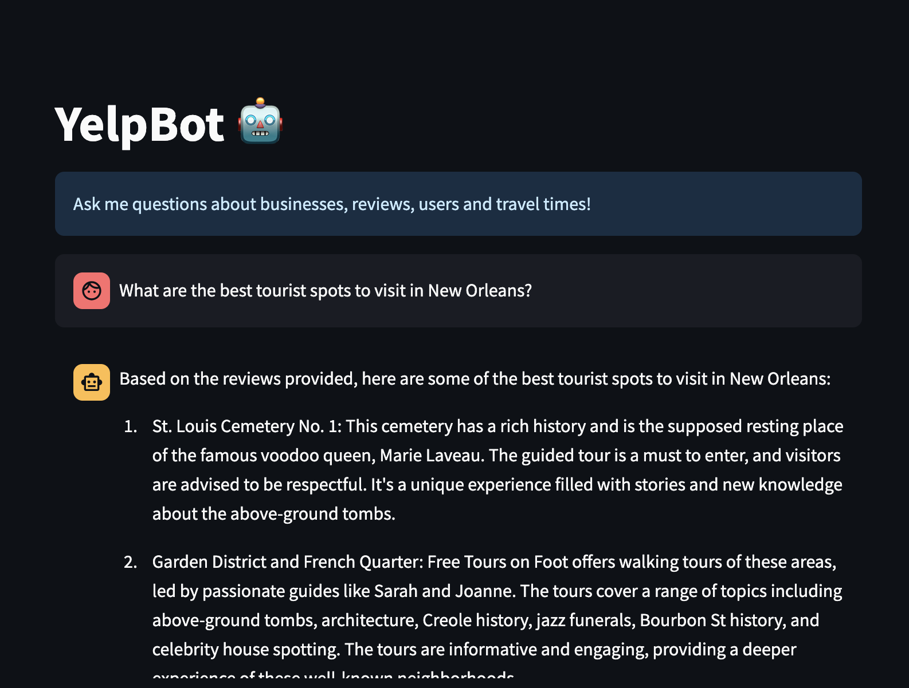

# YelpBot

### Deployed @ [Yelp Chatbot on Streamlit](https://yelp-chatbot.streamlit.app/)

This chatbot interfaces with a [LangChain](https://python.langchain.com/docs/get_started/introduction) agent designed to answer questions about a subset of users, businesses, and reviews on [Yelp](https://www.yelp.com/). 
The agent uses retrieval-augment generation (RAG) over both structured and unstructured data. Data is hosted by [Neo4js](https://neo4j.com/) Graph Database Management System.
Dataset provided by [Yelp](https://www.yelp.com/dataset).

### Credits

* Yelp Dataset provided by [Yelp Open Dataset](https://www.yelp.com/dataset).
* Geomapping and distance calculations based on the API tools provided by [Nominatim Project](https://nominatim.org/) and [Project OSRM](https://project-osrm.org/). 

### To Do
1. `yelp_bulk_csv_write.py`: Fix issues with specifying data types that are affecting aggregation queries.
2. Scale up (< 10% total data currently deployed due to github file size limitations.)  Goal: Full Yelp datasets, including `tips.csv`.
3. ✨ Restrict to domain-specific queries. ("I can only answer questions pertaining to Yelp data.")
4. ✨ New Tool: ProximityFinder. (find closest business by trip time).  `tools/nearest_business_chain.py`
5. ✨ Add Memory i.e. making the YelpBot a conversational bot.
* ~~`yelp_agent.py`: Complete `TripTimes` Tool integration.~~ ✅ 29.03.2024
* ~~Deploy on streamlit community cloud.~~ ✅ 30.03.2024
* E~~nhance TripTimes tool: add query filter for location specification.~~ ✅ 31.03.2024